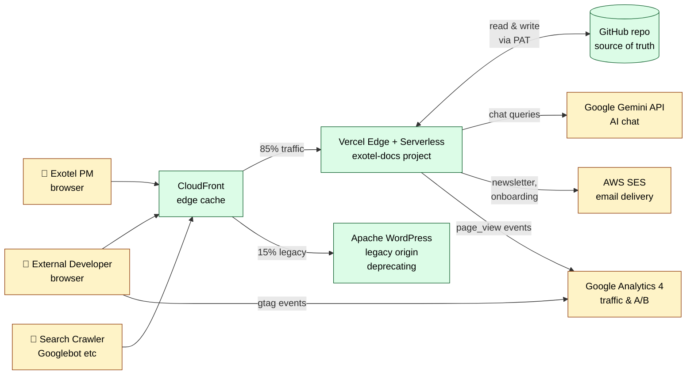

# High-Level Design — Exotel Developer Portal

| Field | Value |
|-------|-------|
| **System** | Exotel Developer Documentation Portal |
| **Production URL** | https://developer.exotel.com |
| **Direct origin** | https://exotel-docs.vercel.app |
| **Repository** | bitbucket.org/Exotel/developer-docs (private) |
| **Status** | Live, public-facing documentation site |
| **Doc owner** | rahul.kumar@exotel.com |
| **Doc version** | 1.0 — drafted 2026-05-04 |

---

## 1. Purpose

The Developer Portal is the public-facing documentation site for Exotel's developer-facing APIs (Voice, SMS, WhatsApp, Voicebot, Contact Center, etc.). It replaces the legacy WordPress site at `developer.exotel.com` (still active behind CloudFront in a small fraction of traffic — see §6 *Migration State*).

It serves three primary audiences:

1. **External developers** — read API reference, code examples, guides
2. **Exotel PMs** — author and edit documentation through a CMS UI
3. **Exotel marketing / dev advocacy** — newsletter, AI-search analytics, content KPIs

---

## 2. System Boundary

**Trust zones**
- **External** (yellow): browsers, third-party services we send data *to* but don't control
- **Trusted Exotel infrastructure** (green): CloudFront, Vercel, Apache, GitHub repo (controlled access)

---

## 3. Hosting & Deployment Topology

| Layer | Provider | Purpose |
|-------|----------|---------|
| **DNS** | Route 53 | Resolves `developer.exotel.com` |
| **CDN / WAF** | AWS CloudFront | Edge caching, weighted routing between Vercel + legacy WordPress |
| **Static site + API** | Vercel | Hosts the Docusaurus build + 12 serverless functions |
| **Source of truth** | GitHub (private repo) | All content + code, includes Decap CMS write-back path |
| **Email** | AWS SES (ap-south-1) | Transactional + newsletter |
| **AI** | Google Gemini API | LLM responses for "Ask AI" |
| **Analytics** | Google Analytics 4 | Pageviews, A/B custom dimension |
| **Legacy WordPress origin** | Apache 2.4.29 on a single VM (managed by infra) | Serves a residual ~15% of traffic; scheduled for full cutover |

---

## 4. Data Inventory & Classification

| Data type | Where it lives | Sensitivity | Retention |
|-----------|---------------|-------------|-----------|
| Documentation markdown / MDX | GitHub repo `/docs/*` | **Public** (intended) | Indefinite, version-controlled |
| Static images | GitHub repo `/static/img/*` | **Public** | Indefinite |
| Newsletter subscriber emails | GitHub repo `data/newsletter-subscribers.json` | **PII** (low — emails only, no other identifiers) | Until unsubscribe, then soft-flag |
| AI chat search log | GitHub repo `data/ai-search-logs.json` | **No PII** (queries only, no IP/user) | Indefinite |
| AI chat feedback | GitHub repo `data/ai-chat-feedback.json` | **No PII** (feedback votes + optional comments + question + answer excerpt) | Indefinite |
| CMS user credentials | Vercel env var `CMS_USERS` (encrypted) | **Confidential** (email:password pairs) | Manual rotation |
| API keys (Gemini, GitHub PAT, AWS SES) | Vercel env vars (encrypted) | **Secret** | Rotate per policy |

**No customer call/SMS/voice data is processed by this portal.** The portal is documentation only — actual API requests devs make using the Exotel platform go to `api.exotel.com` / `api.in.exotel.com`, not this site.

---

## 5. Key Workflows (high level)

### 5.1 Public doc reading
1. Developer's browser → CloudFront → Vercel → static HTML/JS (CDN-cached)
2. Page load fires GA pageview event with `site_variant: 'new_portal'` user property
3. No backend involvement for pure doc reads

### 5.2 PM doc editing (CMS)
1. PM → `developer.exotel.com/admin/` → loads Decap CMS JS bundle
2. PM signs in with email + password → `POST /api/simple-auth` validates against `CMS_USERS` env var → returns shared GitHub PAT (`CMS_GITHUB_TOKEN`)
3. CMS UI uses that PAT to read/write directly to GitHub via `api.github.com` (bypasses our backend)
4. Edits become commits → editorial workflow PR → merge → Vercel auto-builds → live in ~2 min

### 5.3 AI Chat ("Ask AI")
1. Developer types question → `POST /api/chat` (Vercel function)
2. Function reads pre-built knowledge base JSON from Vercel CDN, ranks chunks, builds prompt
3. Function calls Google Gemini API → receives answer
4. Function writes anonymized log entry (question + metadata) to `data/ai-search-logs.json` via GitHub API
5. Returns answer + `response_id` to browser
6. If user clicks 👍/👎 → `POST /api/chat?action=feedback` → writes to `data/ai-chat-feedback.json`

### 5.4 Newsletter subscription
1. Developer enters email → `POST /api/newsletter` → validates → appends to `data/newsletter-subscribers.json` via GitHub API
2. Bulk send (manual trigger): `POST /api/send-newsletter` (auth-protected) → reads subscribers list → AWS SES batch send

### 5.5 Email delivery (onboarding, newsletter)
1. Vercel function or local script → AWS SES SDK (`SendEmailCommand`) → SES delivers via DKIM-signed MTAs from `noreply@exotel.com`
2. Bounces / complaints → SES suppression list (auto-managed)

---

## 6. Migration State

The system is in the **tail end** of a CloudFront-orchestrated A/B migration from legacy WordPress to the new Vercel-hosted Docusaurus site:

| Phase | State |
|-------|-------|
| Old WordPress origin | Still active for ~15% of `developer.exotel.com` traffic at the CloudFront layer |
| New Vercel origin | Serves ~85% of `developer.exotel.com` traffic |
| Vercel direct alias | `exotel-docs.vercel.app` always serves the new site |
| Final cutover | Pending infra team's CloudFront weight change to 100% Vercel |

Until the final cutover, some legacy URLs may resolve differently depending on which origin a request lands on. This is tracked in the daily QA report's "Origin Split Check".

---

## 7. Authentication & Authorization Summary

| Surface | Mechanism | Notes |
|---------|-----------|-------|
| Public doc pages | None | Public read |
| `/admin/` (Decap CMS) | Email + password vs `CMS_USERS` env var; returns shared GitHub PAT | 18 active users (PMs); same PAT rotated when needed |
| `/api/chat`, `/api/newsletter`, `/api/unsubscribe` | None — public POST endpoints | Validated for shape, gated against junk input. Rate-limited at Vercel platform layer. |
| `/api/send-newsletter` | Bearer token in env var | Internal use only; manual trigger |
| Vercel deploys | GitHub auto-deploy webhook (currently broken — manual `vercel --prod` used) | Tracked separately for repair |

---

## 8. Third-Party Dependencies (data flow out of Exotel)

| Service | Data sent | Region | Purpose |
|---------|-----------|--------|---------|
| **Google Gemini API** | User chat questions + chunks of public Exotel docs | Google's region for `generativelanguage.googleapis.com` | Generate AI chat responses |
| **AWS SES** | Recipient email, subject, HTML body | ap-south-1 (Mumbai) | Newsletter + onboarding email |
| **Google Analytics 4** | Anonymized pageview / event data, no PII | Google's GA4 region | Traffic analysis, A/B measurement |
| **GitHub API** | Markdown content, log entries, JSON file writes | GitHub global | Source-of-truth storage |
| **Decap CMS (client-side)** | None — runs entirely in PM's browser, calls GitHub API directly | n/a | CMS authoring UI |

No customer PII flows through any of these (the portal itself doesn't have customer data).

---

## 9. Resilience & Failure Modes (overview)

| Failure | Impact | Mitigation |
|---------|--------|------------|
| Vercel outage | Public docs unavailable until recovery; legacy WordPress still serves ~15% via CloudFront | Vercel has 99.99% SLA on production tier |
| GitHub API outage | New CMS edits and log writes fail; existing site keeps serving | CMS errors are surfaced to PM; logs are best-effort |
| Gemini API outage / quota | "Ask AI" returns rate-limit error; rest of site unaffected | Multi-model fallback (gemini-2.5-flash → 2.0-flash → 2.0-flash-lite) |
| AWS SES outage | Newsletter / onboarding emails fail; emails queue for retry | Queue-and-retry pattern in send scripts |
| CloudFront cache poisoning / outage | Site serves stale or unavailable | Standard CloudFront safeguards; Vercel direct URL still works |

---

## 10. Open Items / Known Risks (for infosec discussion tomorrow)

1. **CMS shared PAT** — all 18 CMS users authenticate against `CMS_USERS` and receive the *same* GitHub PAT (`CMS_GITHUB_TOKEN`). This means any compromised CMS credential gets full repo write access. Per-user PATs would require deeper Decap CMS work.
2. **Auto-deploy from GitHub** — currently broken; deploys are manual via `vercel --prod`. Restoration is tracked separately.
3. **CloudFront 15% legacy split** — until infra closes this, we have a non-zero attack surface on the legacy WordPress origin.
4. **Newsletter signup email-bombing** — `/api/newsletter` has no CAPTCHA, only basic email validation. A bad actor could enumerate the GitHub commit history to find subscribers (the file is public to anyone with repo read access; the repo is private but mirrored to Vercel build environment).
5. **Search log + feedback log** — committed to GitHub on every event. The repo is private, but the questions + free-text comments could in principle contain inadvertent PII (developers pasting credentials into the chat box). We have input gating but no automated PII redaction yet.

The Low-Level Design document covers each of these in detail with specifics on data formats, rate limits, and proposed mitigations.

---

## Companion document

See **LLD-Developer-Portal.md** in this folder for endpoint-by-endpoint specifics, secrets inventory, and threat-model details.
