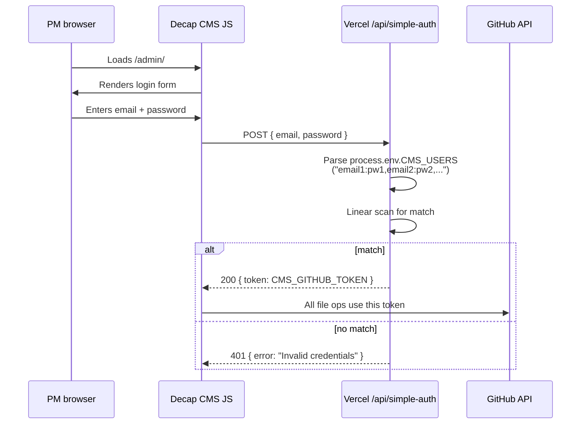
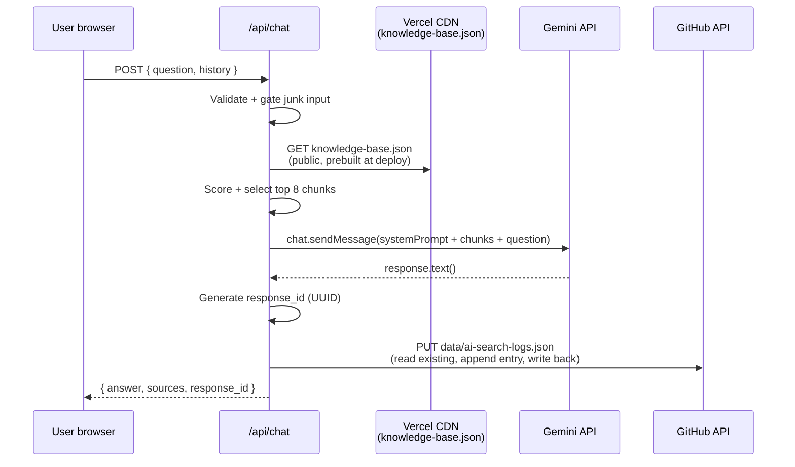
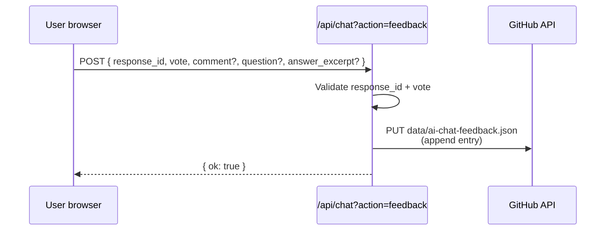
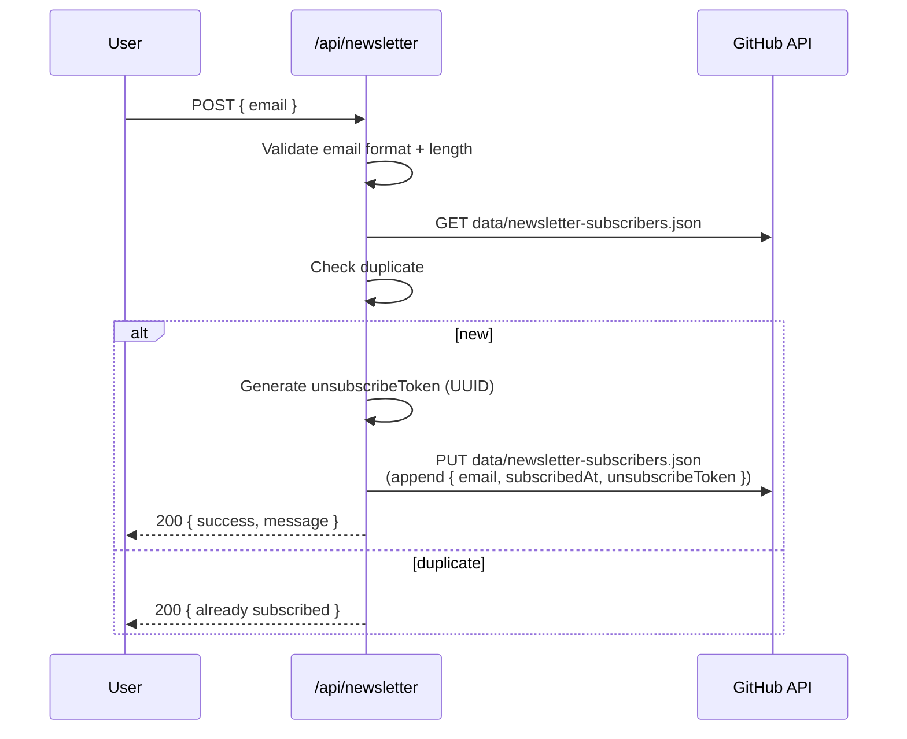
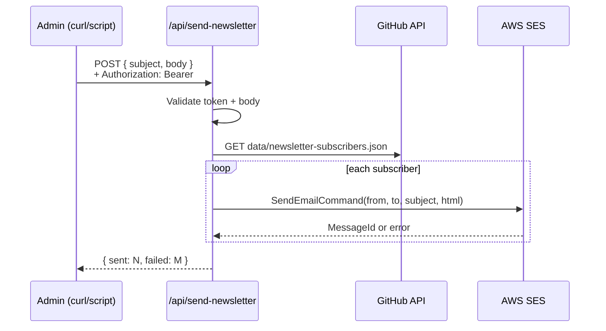

# Low-Level Design — Exotel Developer Portal

| Field | Value |
|-------|-------|
| **System** | Exotel Developer Documentation Portal |
| **Companion to** | HLD-Developer-Portal.md (read first) |
| **Doc owner** | rahul.kumar@exotel.com |
| **Doc version** | 1.0 — drafted 2026-05-04 |

This document gives infosec the operational details: every endpoint, every secret, every third-party data flow, and known security boundaries.

---

## 1. Detailed Component Diagram

```mermaid
flowchart TB
  classDef ext fill:#fef3c7,stroke:#92400e
  classDef vercel fill:#e0e7ff,stroke:#3730a3
  classDef store fill:#dcfce7,stroke:#166534
  classDef thirdparty fill:#fce7f3,stroke:#9d174d

  subgraph BROWSER["👤 Browser"]
    UI[Docusaurus SPA<br/>+ AiChat widget]
    DECAP[Decap CMS bundle<br/>at /admin/]
  end

  subgraph EDGE["AWS CloudFront edge"]
    CF[Distribution<br/>weighted target group]
  end

  subgraph VERCEL["Vercel"]
    direction TB
    STATIC[Static build<br/>Docusaurus output<br/>build/*]
    MW[Edge middleware<br/>middleware.js]
    subgraph FN["Serverless functions (12/12)"]
      direction LR
      FN_CHAT["chat.js<br/>POST /api/chat<br/>POST /api/chat?action=feedback"]
      FN_NL["newsletter.ts<br/>POST /api/newsletter"]
      FN_UNS["unsubscribe.ts<br/>GET /api/unsubscribe"]
      FN_SND["send-newsletter.ts<br/>POST /api/send-newsletter<br/>auth required"]
      FN_AUTH["simple-auth.js<br/>POST /api/simple-auth<br/>CMS login"]
      FN_PROXY["proxy.js<br/>POST /api/proxy<br/>Try-It console proxy"]
      FN_LEG["auth.js, callback.js,<br/>ab-status.js,<br/>make-call.js,<br/>call-script.js,<br/>call-audio.js<br/>(legacy / demo)"]
    end
  end

  subgraph LEGACY["Legacy origin"]
    WP[Apache 2.4.29<br/>WordPress<br/>~15% traffic]
  end

  subgraph GITHUB["GitHub (private repo)"]
    REPO[(rahulkumar-exo/<br/>exotel-docs)]
    DOCS[/docs/*.md]
    DATA["/data/<br/>newsletter-subscribers.json<br/>ai-search-logs.json<br/>ai-chat-feedback.json"]
    CFG[/static/admin/config.yml/]
  end

  subgraph THIRDPARTY["Third-party APIs"]
    GEM[Google Gemini API]
    SES[AWS SES ap-south-1]
    GA[Google Analytics 4<br/>G-HWCFMYZ4FG]
  end

  UI --> CF
  DECAP --> CF
  CF -->|85%| MW
  CF -->|15%| WP
  MW --> STATIC
  MW --> FN_CHAT
  MW --> FN_NL
  MW --> FN_UNS
  MW --> FN_AUTH
  MW --> FN_SND
  MW --> FN_PROXY

  FN_CHAT -->|knowledge base read| STATIC
  FN_CHAT -->|prompt + chunks| GEM
  FN_CHAT -->|append log| REPO
  FN_NL -->|read+write subscribers| REPO
  FN_AUTH -->|validate vs env| FN_AUTH
  FN_SND -->|send| SES

  DECAP -.->|GitHub PAT<br/>direct API calls| REPO
  REPO --> DOCS
  REPO --> DATA
  REPO --> CFG

  UI -->|gtag events| GA

  classDef ext;
  classDef vercel;
  classDef store;
  classDef thirdparty;
  class GEM,SES,GA thirdparty;
  class REPO,DOCS,DATA,CFG store;
  class STATIC,MW,FN_CHAT,FN_NL,FN_UNS,FN_SND,FN_AUTH,FN_PROXY,FN_LEG vercel;
  class WP ext;
```

---

## 2. Endpoint Catalog

All endpoints are served from `https://developer.exotel.com` (CloudFront → Vercel) and `https://exotel-docs.vercel.app` (direct).

### 2.1 Public site

| Path | Purpose | Auth | Notes |
|------|---------|------|-------|
| `/` | Homepage | None | Static |
| `/docs/*` | Documentation pages | None | Static, served from CDN |
| `/admin/` | Decap CMS | Email+password (see §3) | SPA, all logic client-side |
| `/img/*` | Images | None | Static |
| `/sitemap.xml`, `/robots.txt` | SEO | None | Static |

### 2.2 Serverless functions (12/12 of Vercel Hobby plan)

| Endpoint | Method | Auth | Purpose | Source file |
|----------|--------|------|---------|-------------|
| `/api/chat` | POST | None | AI chat — answer a question | `api/chat.js` |
| `/api/chat?action=feedback` | POST | None | Record 👍/👎 on a chat answer | `api/chat.js` (same file, branched by query) |
| `/api/newsletter` | POST | None | Subscribe an email | `api/newsletter.ts` |
| `/api/unsubscribe?token=...` | GET | Token in URL | Unsubscribe via emailed link | `api/unsubscribe.ts` |
| `/api/send-newsletter` | POST | Bearer token (env `NEWSLETTER_AUTH_TOKEN`) | Trigger bulk newsletter send | `api/send-newsletter.ts` |
| `/api/simple-auth` | POST | None (validates `email:password` body) | CMS login — returns shared GitHub PAT | `api/simple-auth.js` |
| `/api/proxy` | POST | None | Server-side proxy used by "Try It" API console (forwards to `api.exotel.com`) | `api/proxy.js` |
| `/api/auth` | GET/POST | Legacy | Old GitHub OAuth flow — unused since simple-auth replaced it | `api/auth.js` |
| `/api/callback` | GET | Legacy | Old OAuth callback — unused | `api/callback.js` |
| `/api/ab-status` | GET | None | A/B status report (legacy, not used) | `api/ab-status.js` |
| `/api/make-call`, `/api/call-script`, `/api/call-audio` | POST/GET | None | Demo "make a call" widget on the homepage | `api/make-call.js` etc. |

**Recommendation for infosec discussion:** Legacy/unused functions (`auth.js`, `callback.js`, `ab-status.js`) should be removed or disabled.

---

## 3. Authentication

### 3.1 CMS login flow (`/api/simple-auth`)



**Storage of credentials**
- `CMS_USERS` env var (Vercel encrypted) — comma-separated `email:password` pairs
- 18 users currently configured
- Passwords are stored **plaintext within the encrypted env var** (Vercel encrypts the env var itself; Vercel functions read it as plaintext at runtime). This is a known weak spot — see §7 *Threat Model — Open Items*.
- Default password for newly-onboarded PMs is `Exotel@123` (encouraged to be rotated; not enforced)

**Token returned**
- `CMS_GITHUB_TOKEN` — a single shared GitHub Personal Access Token with `repo` scope
- All 18 PMs share the same token
- Token rotation is manual (Vercel env update + GitHub PAT regeneration)

### 3.2 Bulk newsletter send (`/api/send-newsletter`)

| Field | Value |
|-------|-------|
| Auth | `Authorization: Bearer <NEWSLETTER_AUTH_TOKEN>` header |
| Token storage | Vercel encrypted env var |
| Used by | Manual trigger only (admin script run by rahul.kumar) |
| Rate limit | None at app layer; relies on Vercel function `maxDuration: 30s` and SES per-second send limits |

### 3.3 No-auth public POST endpoints

`/api/chat`, `/api/newsletter`, `/api/unsubscribe`, `/api/proxy` are all public POST endpoints with no auth.

**Defenses in depth:**
- Input validation (shape + length)
- Junk-input gating on `/api/chat` (rejects pure greetings, gibberish, repeated chars before hitting Gemini)
- Email format validation on `/api/newsletter`
- `/api/proxy` is hardcoded to allow only `api.exotel.com` and `api.in.exotel.com` as upstream destinations — it cannot be used as a generic proxy
- Vercel platform-layer rate limiting + DDoS protections

---

## 4. Secrets Inventory

All secrets are stored as Vercel environment variables (encrypted at rest, scoped to function runtime).

| Env var | Type | Used by | Rotation | Notes |
|---------|------|---------|----------|-------|
| `CMS_GITHUB_TOKEN` / `GITHUB_TOKEN` | GitHub PAT, `repo` scope | `simple-auth.js`, `newsletter.ts`, `chat.js` (logger) | Manual | Shared across CMS users |
| `CMS_USERS` | String (comma-separated email:password) | `simple-auth.js` | Manual on add/remove | 18 users |
| `GEMINI_API_KEY` | Google API key | `chat.js` | Per Google policy | Gemini quota tied to this |
| `AWS_SES_ACCESS_KEY_ID` | AWS IAM access key | `send-newsletter.ts`, onboarding scripts | Per AWS policy | IAM user `exotel-docs-ses` |
| `AWS_SES_SECRET_ACCESS_KEY` | AWS IAM secret | (same as above) | Per AWS policy | |
| `AWS_SES_REGION` | `ap-south-1` | (same as above) | n/a | Hardcoded region |
| `AWS_SES_FROM_EMAIL` | `noreply@exotel.com` | (same as above) | n/a | DKIM-signed sending identity |
| `NEWSLETTER_AUTH_TOKEN` | Random string | `send-newsletter.ts` | Manual | Gates bulk send endpoint |
| `SITE_URL` | `https://exotel-docs.vercel.app` | `chat.js` (knowledge base fetch) | n/a | Configuration |

**No secrets are committed to the repo.** `.gitignore` excludes `.env*` files. Source-controlled defaults exist only for non-secret config.

---

## 5. Data Flows in Detail

### 5.1 AI chat — prompt + log



**What's logged per chat query** (in `data/ai-search-logs.json`):
```json
{
  "timestamp": "ISO-8601",
  "response_id": "UUID",
  "question": "string (truncated to 500 chars)",
  "question_length": 0,
  "has_history": false,
  "history_length": 0,
  "model_used": "gemini-2.5-flash",
  "response_time_ms": 0,
  "relevant_chunks_found": 0,
  "source_pages": [{"title": "", "product": "", "url": ""}],
  "answer_length": 0
}
```

**No IP, no user-agent, no user identifier is logged.** Questions could in principle contain PII the user pasted; we have input gating but no automated PII redaction.

### 5.2 AI chat feedback (👍 / 👎)



**What's logged per feedback event** (in `data/ai-chat-feedback.json`):
```json
{
  "timestamp": "ISO-8601",
  "response_id": "UUID",
  "vote": "up|down",
  "question": "string (truncated 500 chars) | null",
  "answer_excerpt": "string (truncated 1000 chars) | null",
  "comment": "string (truncated 1000 chars) | null",
  "user_agent": "string (truncated 200 chars) | null"
}
```

User-Agent is captured here (only here, not in search log). Used to triage whether a feedback event is from a real browser vs an automated probe.

### 5.3 Newsletter subscribe



### 5.4 Newsletter send (admin only)



### 5.5 Decap CMS edit (PM authoring)

```mermaid
sequenceDiagram
  participant PM as PM browser
  participant Decap as Decap CMS bundle
  participant V as /api/simple-auth
  participant GH as GitHub API

  PM->>Decap: Sign in
  Decap->>V: POST { email, password }
  V-->>Decap: 200 { token: CMS_GITHUB_TOKEN }
  Decap->>Decap: Persists token in localStorage

  PM->>Decap: Edit / save / publish
  Decap->>GH: PUT contents/<file>.md (creates branch)
  Decap->>GH: POST pulls (opens PR)
  Note over Decap,GH: editorial_workflow:<br/>save = open PR<br/>publish = merge PR
  PM->>Decap: Click Publish
  Decap->>GH: PATCH PR + merge
  GH-->>Decap: 200 merged
  Note over GH: Vercel git auto-deploy<br/>currently broken;<br/>manual deploy required
```

---

## 6. Network Security

### 6.1 TLS

| Surface | TLS termination | Cert |
|---------|----------------|------|
| `developer.exotel.com` | CloudFront | ACM-managed |
| `exotel-docs.vercel.app` | Vercel edge | Vercel-managed (Let's Encrypt) |
| Apache WordPress legacy origin | Self-managed at origin VM | Managed by infra team |

All inbound traffic is HTTPS-enforced (HSTS preload set on `developer.exotel.com`).

### 6.2 Security headers

Set on every response from Vercel:

```
Strict-Transport-Security: max-age=63072000; includeSubDomains; preload
X-Content-Type-Options: nosniff
X-Frame-Options: SAMEORIGIN
Referrer-Policy: strict-origin-when-cross-origin
Permissions-Policy: camera=(), microphone=(), geolocation=()
```

CSP is **not** currently set — would tighten this if infosec asks.

### 6.3 CORS

`/api/chat`, `/api/newsletter`, `/api/unsubscribe`, `/api/proxy`:
```
Access-Control-Allow-Origin: *
Access-Control-Allow-Methods: POST, OPTIONS
Access-Control-Allow-Headers: Content-Type
```

**Currently `*` to support embedding from anywhere** — could lock down to `developer.exotel.com` + `exotel-docs.vercel.app` if infosec prefers. Trade-off: blocks external dev tools that probe the docs (e.g. Postman tutorials).

---

## 7. Threat Model — Items for tomorrow's discussion

| # | Risk | Impact | Likelihood | Current mitigation | Proposed |
|---|------|--------|------------|-------------------|----------|
| 1 | Shared CMS GitHub PAT | Compromised PM credential = full repo write | Low (18 trusted users) | Default password is `Exotel@123` — same for all new users | Per-user PATs via proper OAuth, OR enforce password rotation + add 2FA |
| 2 | Plaintext passwords in `CMS_USERS` env var | Compromised Vercel access = all CMS passwords leaked | Very low (Vercel env is encrypted, scoped) | Env var encryption at rest | Hash passwords with bcrypt before storing (would require simple-auth.js refactor + migration) |
| 3 | Newsletter signup abuse | Attacker can pollute the subscribers JSON with bogus emails | Medium | Email format validation, GitHub commit log audit trail | Add CAPTCHA (Cloudflare Turnstile) on the signup form |
| 4 | Search log / feedback may capture pasted PII | Dev pastes their API key into chat → committed to private repo log | Low (private repo) but real | Input length cap, junk-input gating | Add regex-based redaction for known patterns (api keys, phone numbers, email addresses) |
| 5 | `/api/proxy` allows arbitrary `api.exotel.com` calls | Could be used to relay malicious requests with someone else's API credentials | Low (caller supplies their own creds) | Hostname allow-list (only `api.exotel.com` / `api.in.exotel.com`); request body inspection | Add explicit rate limit + per-origin tracking |
| 6 | Legacy WordPress origin still serving 15% of traffic | Any WP CVE → potential compromise of `developer.exotel.com` from that fraction of requests | Low–Medium | WordPress is patched per infra schedule; weight is being reduced | Complete cutover to Vercel; decommission WP origin |
| 7 | No CSP header | XSS in markdown could escalate | Low (markdown is sanitized by Docusaurus) | Docusaurus' sanitizer + React's auto-escaping | Add restrictive CSP (would need to allow Gemini iframe embeds, GA4, fonts) |
| 8 | Decap CMS auth token stored in `localStorage` | XSS on `/admin/` could steal the GitHub PAT | Low (admin interface is internal-only by URL) | URL is unguessable for non-PMs; CMS bundle is third-party (Decap) and audited | Move token to httpOnly cookie via custom auth backend (deeper refactor) |
| 9 | Vercel function secrets read at runtime as plaintext | Standard for serverless; mitigated by Vercel platform isolation | Low | Vercel encrypted env, function isolation per request | Consider AWS Secrets Manager + on-demand fetching for the highest-sensitivity keys (Gemini, SES) |
| 10 | GitHub PAT scope is `repo` (full) | Token can read any private repo of the user it was issued to | Medium | The token belongs to a dedicated user (`rahulkumar-exo`) with no other private repos beyond exotel-docs and one ai-bot account | Move to a fine-grained PAT scoped to *just* `rahulkumar-exo/exotel-docs` |

---

## 8. Logging & Observability

| Source | Sink | Retention |
|--------|------|-----------|
| Vercel function logs (stdout/stderr) | Vercel dashboard | 4 hours (Hobby plan) |
| AI search queries | `data/ai-search-logs.json` in GitHub | Indefinite, manual archival |
| AI chat feedback | `data/ai-chat-feedback.json` in GitHub | Indefinite |
| Newsletter subscribers | `data/newsletter-subscribers.json` in GitHub | Until unsubscribe |
| GA4 events | Google Analytics property G-HWCFMYZ4FG | Per Google retention (default 14 months) |

A **daily automated QA scheduled task** runs at 09:07 IST:
- Site health checks
- API surface checks
- Origin split verification
- Subscribers count + new signups
- AI search analytics with content-gap surfacing
- Feedback summary with all 👎 entries

Owned by `rahul.kumar@exotel.com`, runs on his local machine via Claude Code scheduled-tasks. Output is delivered to that local environment.

---

## 9. Compliance Notes

- **No customer call/SMS/voice/PII data is processed by this portal.** Customer data lives only in the production Exotel platform at `api.exotel.com`.
- **GDPR / DPDP applicability**: limited to newsletter subscriber emails (single field, with unsubscribe mechanism). Subscribers have an unsubscribe link in every email; one-click unsubscribe via tokenized URL.
- **Cookie banner**: not currently shown. Site uses GA4 with `anonymizeIP: true` and stores the `cf_traffic_group` (CloudFront A/B bucket) cookie. Worth discussing whether a banner is required given audience and content type.

---

## 10. Open Questions for the meeting

1. Is the shared GitHub PAT acceptable, or should we move to per-user OAuth?
2. CSP header — what level of strictness do we want?
3. Should we add Cloudflare Turnstile on the newsletter signup?
4. What's the policy on retention of AI search queries / feedback comments? Indefinite or auto-prune?
5. Do we want a cookie banner given GA4 + the A/B cookie?
6. Timeline for full cutover off the legacy WordPress origin?
7. Should we audit / decommission the legacy serverless functions (`auth.js`, `callback.js`, `ab-status.js`)?

---

End of LLD. Reach out to rahul.kumar@exotel.com for any clarifications before the meeting.
